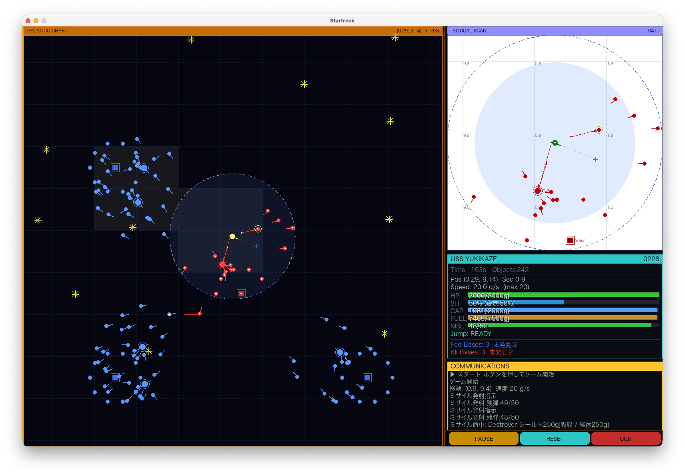

# Startreck

BASICで書かれた往年のテキストゲーム「Star Trek」を、Python + pygame によるリアルタイムGUIゲームとして再実装したプロジェクトです。

## 概要

プレーヤーは宇宙艦 **U.S.S. YUKIKAZE** の艦長として、クリンゴン帝国との戦いに臨みます。連邦・クリンゴンともに3つの基地と5個艦隊（重巡洋艦1隻 + 駆逐艦10隻 + 護衛型駆逐艦）を保有し、互いの基地を巡る戦いが繰り広げられます。AI（BOTコマンダー）が自律的に戦闘を行い、ゲームはプレーヤーの操作の有無にかかわらずリアルタイムで進行します。



**勝敗条件**

| 勝者 | 条件 |
|------|------|
| 連邦 | クリンゴンの基地をすべて破壊する |
| クリンゴン | 連邦の基地をすべて破壊する |

## 動作環境

- Python 3.12+
- [uv](https://github.com/astral-sh/uv)（パッケージ管理）

## 起動方法

プロジェクトディレクトリから直接実行する場合:

```bash
uv run python main.py
```

### `startreck` コマンドとしてインストール

シェルからどこでも `startreck` で起動できるようにするには、ランチャーを
PATH の通ったディレクトリ（例: `~/.local/bin`）にシンボリックリンクします。

```bash
ln -sf "$(pwd)/bin/startreck" ~/.local/bin/startreck
```

以降は任意のディレクトリから次のコマンドで起動できます。

```bash
startreck
```

ランチャー（`bin/startreck`）はシンボリックリンクを辿って本体の
プロジェクトディレクトリを特定し、そこから `uv run python main.py` を
実行します。ゲームログはプロジェクトディレクトリに出力されます。

## 遊び方

### 画面構成

ウィンドウサイズは **1600×1050**。各パネルは Star Trek 風の **LCARS スタイル**でデザインされています。

| エリア | 説明 |
|--------|------|
| GALACTIC CHART（左・大） | 宇宙全体（10×10座標）をプレーヤー中心に表示。オブジェクト密度に応じて艦名ラベルが自動表示される |
| TACTICAL SCAN（右上） | 自艦周囲をズームアップ表示。マウスホイールでズーム調整 |
| USS YUKIKAZE（右中） | HP・シールド・キャパシタ・燃料・ミサイル残弾などをバーグラフで表示 |
| COMMUNICATIONS（右下） | ナビゲーター・ガンナーからの報告をスクロール表示 |

### ゲームの開始

起動直後はゲームが **待機中** です。右パネル下部の **▶ スタート** ボタンをクリックするとゲームが始まります。

### 基本操作（マウス）

全天マップまたはレーダービュー上のオブジェクト・空白をクリックすると、コンテキストメニューが表示されます。

**空白をクリック → 移動**

| メニュー | 動作 |
|----------|------|
| 最大速度で移動 | クリック地点へ全速で移動 |
| 半速で移動 | 最大速度の50%で移動 |
| 低速で移動 | 最大速度の25%で移動 |
| 停止 | 即時停止 |

**敵艦・敵基地をクリック → 攻撃**

| メニュー | 条件 |
|----------|------|
| ミサイル攻撃 | ミサイル残弾あり |
| ビーム攻撃 | 常時（エネルギー消費） |
| この目標へ移動 | 常時 |

**レーダービューで敵ミサイルをクリック → 即時ビーム迎撃**

レーダービュー上で敵ミサイルをクリックすると、ポップアップなしで即座にビームを発射して迎撃します。

**自艦をクリック → シールド・補給・ジャンプ**

| メニュー | 条件 |
|----------|------|
| シールド 0 / 50 / 100% | 常時 |
| 補給 | 連邦基地から150 grid以内 |
| ジャンプ先を選択 | キャパシタ充足時 |

**連邦基地をクリック**

| メニュー | 条件 |
|----------|------|
| この基地へ移動 | 常時 |
| ジャンプ | キャパシタ充足時 |

### キーボードショートカット

| キー | 動作 |
|------|------|
| `Space` | 即時停止 |
| `S` | シールドのオン（100%）/ オフ（0%）トグル |
| `Esc` | ゲーム終了 |

### レーダーズームと情報表示

- レーダービュー上でマウスホイールを回すと、表示範囲をズームイン・アウトできます。点線の円は自艦のレーダー探知範囲を示します。
- 自艦アイコン内に **白い点** が表示されているとき、自艦は敵レーダーに補足されています。
- 全天マップで艦艇・基地にマウスカーソルを乗せると、HP残量・燃料残量・ミサイル残弾のツールチップが表示されます（インテグレータに記録済みの敵オブジェクトも対象）。

### ステータスパネルの読み方

| 表示 | 説明 |
|------|------|
| `Fed Bases: N` | 連邦基地の残存数。`未発見:N` は敵インテグレータに未登録の基地数 |
| `Kli Bases: N` | クリンゴン基地の残存数。`未発見:N` は自艦インテグレータに未登録の基地数 |

### 艦種一覧

| 艦種 | 所属 | 特徴 |
|------|------|------|
| U.S.S. YUKIKAZE（特務艦） | 連邦（プレーヤー） | 高速・高耐久・ジャンプドライブ搭載、ビーム連射制限なし |
| 重巡洋艦 | 連邦・クリンゴン旗艦 | 艦隊を指揮。補給能力あり。燃料・ミサイル積載量大 |
| 駆逐艦 | 連邦・クリンゴン共通 | 小型・高機動の主力戦闘艦。HP・燃料・ミサイルが低下するとホームへ補給退避 |
| 護衛型駆逐艦 | 連邦・クリンゴン共通 | 基地・旗艦の周囲に配備。ホームの近傍を守り、ホームから離れすぎると自動帰還 |

### BOTの行動

各AI艦はインテグレータ（自艦の「全天マップ」）に記録された情報をもとに行動します。

- **攻撃優先順位**: 攻撃してきた敵 → 割り当て敵基地 → 最近傍の敵基地 → 最近傍の敵艦
- **補給退避**: HP ≤ 20% / 燃料 ≤ 20% / ミサイル ≤ 10% でホームへ補給に向かう
- **旗艦の補給**: 補給退避に入る際、最近傍の味方基地にホームを切り替えてから向かう

### ゲームログ

ゲーム終了時（勝敗確定）にカレントディレクトリへ `gamelog_日時.md` が自動生成されます。双方の残存艦艇数・ミサイル統計・燃料統計・ビーム統計が記録されます。

## TIPS

- **敵基地の発見がプレーヤーの主な任務**: BOTはインテグレータに登録された敵基地しか攻撃しません。U.S.S. YUKIKAZE は長距離レーダーとジャンプドライブを活かして宇宙を駆け回り、クリンゴン基地を発見して味方艦隊に共有しましょう。ステータスパネルの「未発見:N」が指針になります。
- **艦名で戦況を読む**: 全天マップには艦艇・基地の固有名（連邦は欧米の首都名、クリンゴンはロシア・中国の地名、基地は星座名）がオブジェクト密度に応じて自動表示されます。どの艦が危険にさらされているか一目でわかります。
- **ジャンプ前にキャパシタを確認**: ジャンプドライブにはキャパシタ容量の **50%以上** の残量が必要です。シールドやビーム多用後はキャパシタが枯渇しているため、ジャンプ前にステータスパネルの CAP バーを確認してください。
- **ミサイル連射はほどほどに**: レーダービューで敵をクリックし続けることでミサイルを連射できますが、ゲーム内に補給制限はありません。自分ルールを設けて使い過ぎを戒めると、緊張感のある戦いを楽しめます。
- **ヒーローのストーリーを楽しむ**: うまく立ち回ればプレーヤーが必ず勝利できるバランスです。ヘマをしないよう慎重に行動しながら、ヒーローとして宇宙を救うストーリーを想像しながら遊んでみましょう。

## 技術構成

- **言語**: Python 3.12
- **描画**: pygame 2.6
- **テスト**: pytest
- **AIコーディング**: Claude Code (Anthropic)

```
uv run pytest        # テスト実行
```
